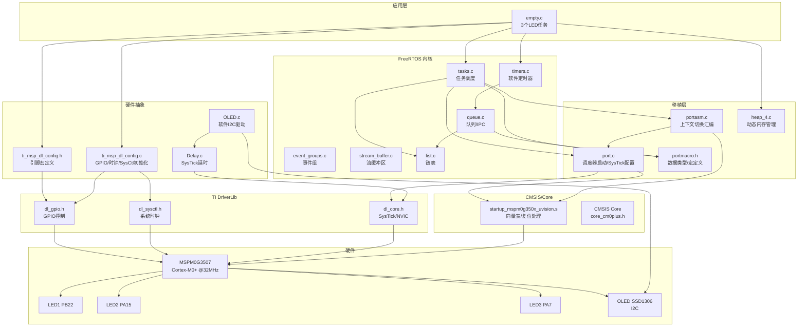

# 项目架构图 — FreeRTOS on MSPM0G3507

## 目录结构

```
3507mode/                          ← 项目根目录
│
├── empty.c                        ← 主程序（3个LED任务）
├── FreeRTOSConfig.h               ← FreeRTOS 配置
├── ti_msp_dl_config.c             ← SysConfig 生成：时钟/GPIO初始化
├── ti_msp_dl_config.h             ← SysConfig 生成：引脚宏定义
├── empty.syscfg                   ← SysConfig 可视化配置源文件
│
├── keil/                          ← Keil MDK 工程文件
│   ├── empty_LP_MSPM0G3507_nortos_keil.uvprojx
│   ├── startup_mspm0g350x_uvision.s    ← 启动文件/向量表
│   └── mspm0g3507.sct                  ← 链接脚本
│
├── FreeRTOS/                      ← FreeRTOS 内核源码
│   ├── src/                       ← 内核源文件
│   ├── include/                   ← 内核头文件
│   └── portable/ARM_CM0/          ← Cortex-M0+ 移植层
│
├── DriveLib/                      ← TI DriverLib 源文件 (.c)
├── OLED/                          ← OLED 显示驱动（软件 I2C）
├── System/                        ← 延时函数（Delay_us/ms）
├── Hardare/                       ← 硬件抽象层
│
└── source/                        ← TI SDK（头文件 + CMSIS）
    ├── ti/driverlib/              ← 驱动库头文件
    ├── ti/devices/                ← 器件头文件（寄存器定义）
    └── third_party/CMSIS/         ← CMSIS-Core 标准头文件
```

## 模块依赖关系



## 任务配置

| 任务名 | 栈大小 | 优先级 | 周期 | 操作 |
|--------|--------|--------|------|------|
| LED1 | 128 words | 1 | 300ms | `toggle(PB22)` |
| LED2 | 128 words | 1 | 500ms | `toggle(PA15)` |
| LED3 | 128 words | 1 | 700ms | `toggle(PA7)` |

## 编译流程

```
Keil Build
  │
  ├── 1. Before Build: syscfg.bat
  │       └── SysConfig CLI 生成 ti_msp_dl_config.{c,h}
  │
  ├── 2. Compile: ARMCLANG V6.22
  │       ├── empty/*.c          ← 应用 + FreeRTOS 内核 + 驱动
  │       └── startup.s          ← 汇编启动文件
  │
  └── 3. Link: 根据 mspm0g3507.sct
          ├── IROM 0x00000000 (128KB Flash)
          └── XRAM 0x20200000 (32KB SRAM)
```

## 启动流程

```
Reset_Handler
  │
  ├── __main (C运行时初始化)
  │
  ├── main()
  │   ├── SYSCFG_DL_initPower()      ← GPIOA/B 供电
  │   ├── SYSCFG_DL_GPIO_init()      ← 引脚模式配置
  │   ├── SYSCFG_DL_SYSCTL_init()    ← 系统时钟 32MHz
  │   ├── LED 初始熄灭
  │   ├── xTaskCreate() × 3          ← 创建任务
  │   └── vTaskStartScheduler()
  │
  └── FreeRTOS 接管
      ├── xPortStartScheduler()
      │   ├── 设置 PendSV/SysTick 优先级
      │   ├── vPortSetupTimerInterrupt()  ← 配置 SysTick 1ms
      │   └── prvPortStartFirstTask()     ← 切换到 PSP
      │
      └── SysTick_Handler (1ms)
          └── xTaskIncrementTick()
              ├── 唤醒阻塞任务
              └── 触发 PendSV 上下文切换
```
